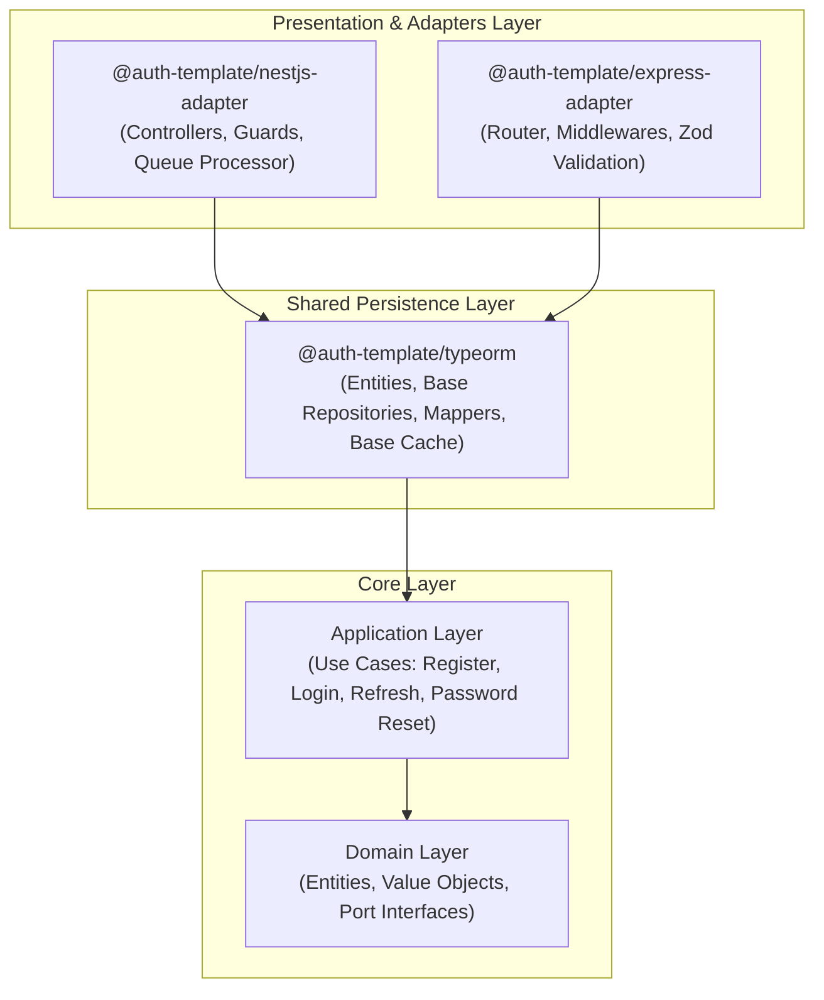

# Architecture Overview

## Introduction

This system uses Clean Architecture principles, ensuring business logic independence from frameworks and external services.

## Monorepo Architecture



## Core Principles

### 1. Dependency Rule

Dependencies point strictly inward towards the Core Domain:

```text
 Presentation & Adapters → Shared Persistence (TypeORM) → Application Core → Domain Core
```

### 2. Framework & Infrastructure Independence

The core package (`@auth-template/core`) contains zero web framework or ORM dependencies. You can:

- Use **NestJS** (`@auth-template/nestjs-adapter`) for full enterprise NestJS apps.
- Use **Express.js** (`@auth-template/express-adapter`) for lightweight Express microservices.
- Share TypeORM persistence definitions across framework adapters via `@auth-template/typeorm`.
- Replace Redis with in-memory fallback without touching business logic.

### 3. Testability

Every layer can be tested independently:

- **Domain**: Pure unit tests without mocks (`User.spec.ts`, `Email.spec.ts`)
- **Application**: Unit tests with mock repositories (`RegisterUser.spec.ts`)
- **Adapters & Repositories**: Integration tests with in-memory/test DB (`express-adapter.spec.ts`, `auth.integration-spec.ts`)
- **Presentation / API**: E2E tests using Supertest (`auth.e2e-spec.ts`)

---

## Layer Details

### 1. Domain Layer (`packages/core/src/domain/`)

Contains core business entities and rules:

- **Entities**: `User`, `RefreshToken`, `Session`, `AuditLog`
- **Value Objects**: `Email`, `Password`, `Token`, `UserId`, `SessionId`, `AuditLogId`
- **Repository Interfaces**: `IUserRepository`, `ITokenRepository`, `ISessionRepository`, `IAuditLogRepository`

### 2. Application Layer (`packages/core/src/application/`)

Contains business use cases and port definitions:

- **Use Cases**: `RegisterUserUseCase`, `LoginUser`, `RefreshTokenUseCase`, `LogoutUser`, `LogoutAllDevices`, `ChangePassword`, `VerifyEmail`
- **Ports**: `IPasswordHasher`, `ITokenGenerator`, `IEmailSender`, `ILogger`, `IEventBus`, `IRateLimiter`

### 3. Shared Persistence Layer (`packages/typeorm/`)

Provides framework-agnostic TypeORM persistence foundations:

- **Entities**: `UserEntity`, `RefreshTokenEntity`, `SessionEntity`, `AuditLogEntity`
- **Mappers**: `UserMapper`, `RefreshTokenMapper`, `SessionMapper`
- **Base Repositories**: `BaseTypeOrmUserRepository`, `BaseTypeOrmTokenRepository`
- **Base Caching**: `BaseMemoryCache`, `BaseRedisCache`

### 4. Framework Adapters

#### NestJS Adapter (`packages/nestjs-adapter/`)
- **`AuthModule`**: Dynamic NestJS module supporting Redis/Memory caching and optional Bull/Redis email queue.
- **Presentation**: `AuthController`, `JwtAuthGuard`, `RolesGuard`, `@CurrentUser()`, `@Public()`, `@Roles()` decorators.
- **Infrastructure**: `NodemailerEmailSender`, `QueueEmailSender` (Bull producer), `EmailProcessor` (Bull consumer).

#### Express Adapter (`packages/express-adapter/`)
- **`createAuthRouter()`**: Factory function returning an Express router pre-wired with core use cases.
- **Middlewares**: `jwtAuth.middleware`, `roles.middleware`, `validate.middleware` (Zod schemas), `errorHandler.middleware`.

---

## Design Patterns

1. **Clean Architecture & DDD**: Clear separation between Domain, Application, and Frameworks.
2. **Repository Pattern**: Abstraction over database operations (`IUserRepository` -> `BaseTypeOrmUserRepository`).
3. **Adapter Pattern**: Framework-specific adapters wrapping core application logic.
4. **Producer/Consumer Queue Pattern**: `QueueEmailSender` enqueues email jobs processed asynchronously by `EmailProcessor` via Bull & Redis.
5. **Result Pattern**: Explicit success/failure error handling without throwing runtime exceptions for expected validation errors.

## References

- [ADR 001: Clean Architecture](decisions/001-clean-architecture.md)
- [ADR 002: Repository Pattern](decisions/002-repository-pattern.md)
- [ADR 003: Event-Driven](decisions/003-event-driven.md)

